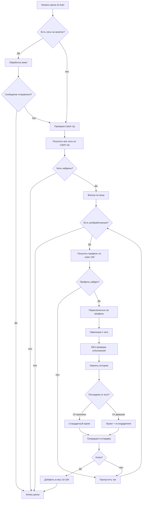

# Catch Up Integration - Полная Документация

## 📋 Обзор

**Catch Up** — это специальный раздел в Luxee, где показываются чаты, которые требуют внимания. AI автоответчик обрабатывает эти чаты **только после** того, как все обычные анкеты проверены и не найдено необработанных сообщений.

---

## 🔄 Логика Работы

### **1️⃣ Приоритет Обработки**

```
1. АКТИВНАЯ АНКЕТА (с новыми сообщениями)
2. ДРУГИЕ АНКЕТЫ (с новыми сообщениями)
3. CATCH UP (если нет новых сообщений на анкетах) ← РЕЗЕРВ
```

**Код:** `backend/src/services/aiAuto/index.js` (строки 334-407)

```javascript
// Catch Up проверяется ТОЛЬКО если нет обычных чатов
if (!messageSent) {
    utils.log('AI Auto', '🔍 No chats found in main cycle, checking Catch Up...');
    const catchUpChats = await catchUpScanner.getAllCatchUpChats(page);
    // ...
}
```

---

### **2️⃣ Особенности Catch Up Чатов**

#### ❌ **НЕ проверяем `unAnswered`**

Для Catch Up чатов **игнорируется** флаг `unAnswered` — мы пишем в любом случае!

**Код:** `backend/src/services/aiAuto/chatProcessor.js` (строки 88-115)

```javascript
if (!isCatchUp) {
    // 📋 ОБЫЧНЫЕ ЧАТЫ: проверяем unAnswered
    const unAnsweredCheck = await profileScanner.checkActiveChatUnAnswered(page, chat.chatId);
    if (!unAnsweredCheck.isUnAnswered) {
        return { sent: false, reason: 'already_answered' };
    }
} else {
    // 🔥 CATCH UP: НЕ проверяем unAnswered - пишем в любом случае!
    utils.log('Chat Processor', '🎯 Catch Up mode: skipping unAnswered check');
}
```

#### 🎯 **Два типа промтов**

**A) Последнее сообщение от мужчины:**
- Используем стандартный промт для типа сообщения

**B) Последнее сообщение от девушки (re-engagement):**
- Используем стандартный промт + короткая подсказка:
  ```
  NOTE: The man saw your last message but didn't reply. 
  Re-engage him with a fresh question based on chat history.
  ```

**Код:** `backend/src/services/aiAuto/chatProcessor.js` (строки 136-151)

```javascript
if (isCatchUp) {
    typeInstructions = chatMessagesExtractorService.getAIInstructionsForMessageType(
        history.lastMessage.messageType,
    );
    
    if (history.lastMessage.isFromProfile) {
        typeInstructions += `\n\nNOTE: The man saw your last message but didn't reply. Re-engage him with a fresh question based on chat history.`;
        utils.log('Chat Processor', '💬 Catch Up: last from profile, added re-engagement note');
    } else {
        utils.log('Chat Processor', '📬 Catch Up: last from man, standard reply');
    }
}
```

---

### **3️⃣ Черный Список (Cache)**

После ответа на Catch Up чат, он добавляется в **кеш на 10-16 часов** (случайное время).

#### **Формат ключа кеша:**
```
${accountId}_${profileUid}_${manUid}
```

**Важно:**
- `profileUid` — это **inner UID** профиля (не outer!)
- Кеш работает **только для конкретного Luxee аккаунта**
- Один мужчина может общаться с разными анкетами (разные ключи)

**Код:** `backend/src/services/aiAuto/catchUpScanner.js` (строки 6-59)

```javascript
// Глобальный кеш
const catchUpProcessedCache = new Map();

const isChatProcessed = (accountId, profileUid, manUid) => {
    const key = `${accountId}_${profileUid}_${manUid}`;
    const cached = catchUpProcessedCache.get(key);
    
    if (!cached) return false;
    
    // Проверяем срок действия (10-16 часов)
    if (Date.now() > cached.expiresAt) {
        catchUpProcessedCache.delete(key);
        return false;
    }
    
    return true;
};

const markChatAsProcessed = (accountId, profileUid, manUid) => {
    const key = `${accountId}_${profileUid}_${manUid}`;
    
    // Случайное время от 10 до 16 часов
    const randomHours = 10 + Math.random() * 6;
    const expiresAt = Date.now() + randomHours * 60 * 60 * 1000;
    
    catchUpProcessedCache.set(key, {
        processedAt: Date.now(),
        expiresAt: expiresAt,
    });
};
```

---

### **4️⃣ Поиск Профилей (Outer → Inner UID)**

Catch Up чаты используют **outer UID** в `data-identity`, но нам нужен **inner UID** для переключения профиля.

**Проблема:**
- `chatId = "2400223_2850054"` (outer UID профиля)
- `modelsChat.getProfile.data[2400223]` — не существует!

**Решение:**
```javascript
// 1️⃣ Прямой поиск (inner UID)
const profileData = modelsChat.getProfile.data[uid];
if (profileData) return profileData;

// 2️⃣ Поиск через outer → inner
const outerProfile = modelsChat.getProfile.outer[uid];
if (outerProfile) {
    const innerUid = outerProfile.import_uid; // 612222
    return modelsChat.getProfile.data[innerUid];
}
```

**Код:** `backend/src/services/aiAuto/utils.js` (строки 178-234)

---

## 📊 Полный Цикл Обработки Catch Up



---

## 🗂️ Структура Файлов

### **1. index.js** - Главный оркестратор
- Управляет приоритетами (анкеты → Catch Up)
- Проверяет кеш перед обработкой
- Сохраняет обработанные чаты в кеш

### **2. catchUpScanner.js** - Сканер Catch Up
- Открывает Catch Up раздел
- Извлекает все чаты (БЕЗ фильтра `unAnswered`)
- Управляет кешем (10-16 часов)

### **3. chatProcessor.js** - Обработчик чатов
- Навигация к чату
- Проверка `unAnswered` (ТОЛЬКО для обычных чатов!)
- Извлечение истории
- Генерация промта (стандартный / re-engagement)
- Отправка сообщения

### **4. utils.js** - Утилиты
- `getProfileByUid()` — поиск профиля по outer/inner UID
- `switchToProfile()` — переключение профиля
- Логирование

---

## 🧪 Примеры Логов

### **✅ Успешная обработка Catch Up:**

```
[23:11:37.617] [AI Auto] 🔍 No chats found in main cycle, checking Catch Up...
[23:11:37.618] [Catch Up Scanner] 🎯 Opening Catch Up...
[23:11:39.676] [Catch Up Scanner] ✅ Found 3 chats in Catch Up
[23:11:39.676] [AI Auto] 📬 Found 3 chats in Catch Up
[23:11:39.687] [AI Auto] 🎯 Processing 3 Catch Up chats...

[23:11:39.687] [AI Auto] Processing Catch Up: Michael (profile: Aksenia)
[23:11:39.688] [Chat Processor] 📝 Processing chat 2400223_2850054...
[getProfileByUid] Found outer UID 2400223, inner UID: 612222
[23:11:43.319] [Chat Processor] 🎯 Catch Up mode: skipping unAnswered check
[23:11:43.321] [Chat Processor] ✅ Extracted 10 messages
[23:11:43.323] [Chat Processor] 💬 Catch Up: last from profile, added re-engagement note
[23:11:50.576] [Chat Processor] ✅ Generated and sent: "Hey Michael..."
[23:11:50.576] [Catch Up Cache] 💾 Cached: 6a5934992d3a768fb4bbe782_612222_2850054 for 13.4h
```

---

## 🔧 Переменные и Идентификаторы

### **В catchUpScanner.js:**
- `profileUidOuter` — outer UID из `data-identity`
- `manUid` — UID мужчины

### **В chatProcessor.js:**
- `isCatchUp` — флаг режима Catch Up
- `profile.uid` — **inner UID** профиля (главный)
- `profile.allUids` — массив всех UIDs (inner + outer)

### **В index.js:**
- `accountId` — ID Luxee аккаунта
- `messageSent` — глобальный флаг успешной отправки

---

## 🎯 Ключевые Отличия от Обычных Чатов

| Параметр | Обычные чаты | Catch Up чаты |
|----------|-------------|---------------|
| **Приоритет** | Высокий (1-2) | Низкий (3, резерв) |
| **Проверка unAnswered** | ✅ Да | ❌ Нет |
| **Черный список** | ❌ Нет | ✅ Да (10-16h) |
| **Re-engagement** | ❌ Нет | ✅ Да (если последнее от девушки) |
| **Поиск профиля** | Прямой | Outer → Inner |

---

## ⚠️ Важные Примечания

1. **Кеш только для Catch Up** — обычные чаты не кешируются
2. **Inner UID для кеша** — используем inner, не outer!
3. **10-16 часов случайно** — чтобы не было паттернов
4. **Один чат за цикл** — после успешной отправки выходим
5. **Промт короткий** — длинные промты приводили к бреду от AI

---

## 📝 История Изменений

### v1.0 (16.07.2026)
- ✅ Реализована интеграция Catch Up
- ✅ Добавлена проверка кеша (10-16 часов)
- ✅ Поддержка outer → inner UID
- ✅ Отключена проверка `unAnswered` для Catch Up
- ✅ Добавлен промт для re-engagement (короткий вариант)

---

## 🔍 Отладка

### Проверить кеш:
```javascript
const stats = catchUpScanner.getCacheStats();
console.log('Cache:', stats);
// { total: 5, active: 3, expired: 2 }
```

### Очистить кеш вручную:
```javascript
catchUpScanner.cleanupExpiredCache();
```

### Проверить является ли чат обработанным:
```javascript
const isProcessed = catchUpScanner.isChatProcessed(accountId, profileUid, manUid);
```

---

## ✅ Итоговая Логика

1. **Проверяем все анкеты** — если есть необработанные сообщения
2. **Если нет** — открываем Catch Up
3. **Фильтруем по кешу** — пропускаем обработанные (10-16h)
4. **Получаем профиль** — outer UID → inner UID
5. **Переключаемся** — на нужный профиль
6. **БЕЗ проверки unAnswered** — пишем в любом случае
7. **Определяем промт** — стандартный или с re-engagement
8. **Отправляем** — сообщение
9. **Кешируем** — на 10-16 часов (случайно)
10. **Выходим** — из цикла (один чат за раз)

---

**Автор:** AI Assistant  
**Дата:** 16.07.2026  
**Версия:** 1.0
